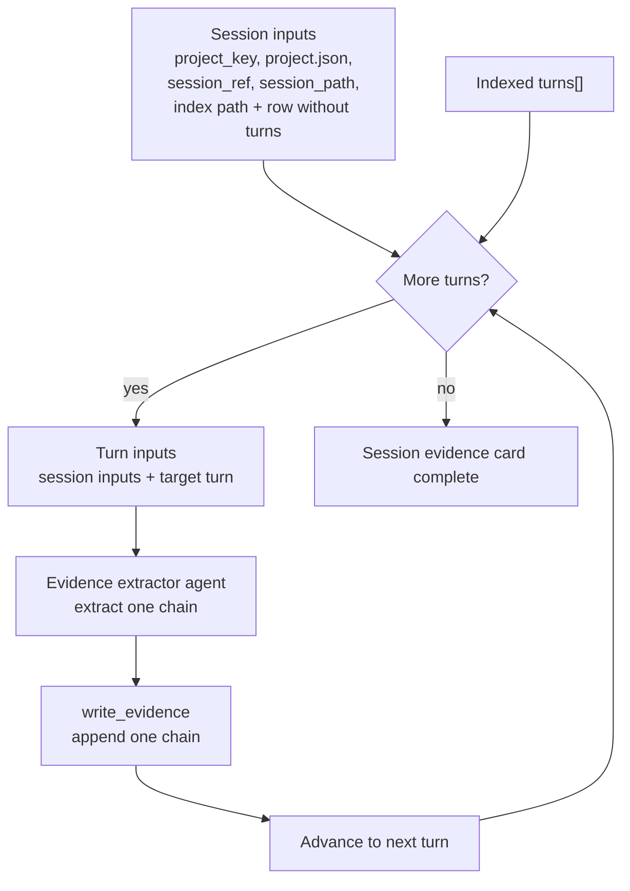

# Evidence Contract

The evidence contract defines the evidence data model and the grounding rules for evidence
extraction. It specifies what evidence cards and chains look like, what makes a citation valid,
and what extractors must follow when producing evidence from indexed sessions.

The prepared workspace layout is defined by the [Workspace Layout](../workspace-layout.md).
This contract operates inside that workspace. Evidence files are generation artifacts written
after preparation; they do not change the preparation layout or the meaning of
`sessions.index.jsonl`.

## Extractor Inputs

An evidence extractor receives prepared context for exactly one indexed turn:

- `project_key`
- `project.json` content
- `session_ref`
- the session index path, `projects/<project_key>/sessions.index.jsonl`, relative to the prepared
  workspace root that is the extractor's current working directory
- `session_path`, resolved by the orchestrator relative to the prepared workspace root
- the exact `projects/<project_key>/sessions.index.jsonl` row for that session, with `turns`
  removed
- one target turn copied from that row's `turns[]`

The supplied index row is the authoritative session metadata. The target turn is the only turn the
extractor may write in that invocation. The target turn supplies `turn_ref`, `turn_start_line`,
and `turn_end_line`; extraction writes `turn_ref` into the evidence chain, and the line bounds
remain the citation boundary. The extractor reads the session file at `session_path`, which the
orchestrator resolves from `projects/<project_key>/<index_row.session_path>` so the extractor can
read it directly from the workspace current working directory.

The extractor writes one draft chain at a time through `write_evidence`, passing the project
key, `session_ref`, and the draft evidence chain. The MCP server owns canonical card creation,
structural checks, and atomic writes.

Extraction is orchestrated in indexed turn order. The orchestrator provides the first target turn,
waits for its evidence chain to be written, then invokes extraction for the next target turn.



## Session Evidence Cards

Report generation decomposes copied sessions into structured session evidence cards before
project-level or day-level synthesis.

An existing session evidence card maps one-to-one to one row in one project's
`sessions.index.jsonl`. It does not need a separate `card_id`; its stable identity is
`(project_key, session_ref)`.

`session_ref` is the report-facing handle used by citations. `source_session_id` remains source
provenance in the session index and should not replace `session_ref` in generated report
citations.
Evidence cards should not duplicate file locators such as `session_path`; consumers that need the
copied session file resolve `(project_key, session_ref)` through the project session index.

The canonical storage model is multiple per-session card files, not one flat
`evidence_cards.jsonl` file. Agents write evidence through the tools on the
[Evidence Extraction Tools](./mcp-tools/evidence-extraction.md) page; the MCP server creates or
updates canonical session evidence cards.

Each session evidence card contains one evidence chain for each `turns[]` item in the associated
`sessions.index.jsonl` row. Because one turn maps to one chain, `turn_ref` is the chain's stable
handle within the session evidence card. A committed chain is identified as
`(project_key, session_ref, turn_ref)`.

Current runtime `report.md` validation still uses direct session-line Markdown citations:
`[project=<project_key>;session=<session_ref>;lines=<start>-<end>]`. The intended future citation
chain is `report.md -> work item -> evidence card -> turn_ref + lines`.

Session evidence cards are stored under the project directory inside the prepared workspace:

```text
projects/<project_key>/
├── project.json
├── sessions.index.jsonl
├── sessions/
└── evidence/
    └── S0001.json
```

Example canonical card:

```json
{
  "schema_version": 1,
  "project_key": "ReportGenerator-e6ff7eeda632",
  "session_ref": "S0001",
  "evidence_chains": [
    {
      "turn_ref": "T0001",
      "trigger": {
        "type": "explicit_user_message",
        "summary": "User asked the agent to study Claude session filename conventions.",
        "quoted_messages": [
          {
            "text": "Please study how Claude session filenames are formed and compare them with our design wording.",
            "citations": [
              {"lines": "45-46"}
            ]
          }
        ],
        "citations": [
          {"lines": "45-46"}
        ]
      },
      "agent_reactions": [
        {
          "summary": "Agent inspected local Claude session filename conventions and compared them with the current design wording.",
          "citations": [
            {"lines": "51-58"}
          ]
        }
      ],
      "outcomes": [
        {
          "category": "research_outcome",
          "summary": "Claude session naming conventions were investigated and summarized.",
          "citations": [
            {"lines": "80-120"}
          ]
        }
      ],
      "observed_checks": [],
      "terminal_state": {
        "type": "material_result",
        "summary": "The agent produced an investigation summary and did not show independent review in the extracted evidence.",
        "citations": [
          {"lines": "80-120"}
        ]
      },
      "materiality": "material"
    }
  ]
}
```

## Evidence Chains

An evidence chain represents one indexed turn and the agent reaction owned by that turn:

```text
turn -> trigger -> agent_reactions -> outcomes and/or terminal_state
```

Field definitions and extraction rules are in the evidence extractor prompt. Controlled evidence
values and their descriptions are maintained in the prompt Python API and rendered into that
runtime prompt.

The write surface for one extracted chain is
[`write_evidence`](./mcp-tools/evidence-extraction.md#write_evidence), which accepts the chain as an
`evidence_chain` and appends it to the canonical session evidence card. The committed write result
uses the chain's `turn_ref`.
Required write-time checks are listed in
[Evidence Extraction Tools: Structural Rules](./mcp-tools/evidence-extraction.md#structural-rules).

## Evidence Extractor Prompt

Prompt source: `src/prompt_diary/generate/prompts/evidence-extractor.md` — loaded at runtime by the
orchestrator.

See [Evidence Extractor Prompt](./evidence-extractor-prompt.md).

Short next-turn prompt source: `src/prompt_diary/generate/prompts/evidence-extractor-next-turn.md` — loaded
at runtime by the orchestrator when the same extractor agent is assigned another turn from the same
session.

````text
{{#include ../../../src/prompt_diary/generate/prompts/evidence-extractor-next-turn.md}}
````
