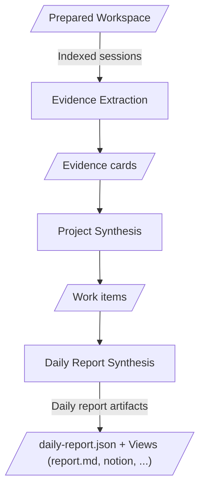

# Report Generation

Report generation is where Prompt Diary realizes the [product purposes](../product.md#purposes).
It turns a prepared workspace into daily report artifacts that communicate the day's work, make
evidence quality visible, assess observable engagement faithfully, and surface team learning from
AI-agent usage. Those purposes converge in the final report-producing phase.

Generation starts from the [Workspace Layout](../workspace-layout.md). It should not rediscover raw
assistant sessions or reinterpret the report date. If the workspace is missing, the CLI may run
preparation first; once generation starts, the prepared workspace is the evidence boundary.

Generation is not a transcript summary, a Git summary, or an unrestricted investigation. It must
present only claims grounded in copied sessions through the project session indexes.

## Page Role

This page defines the generation orchestration contract: phase boundaries, durable artifact
handoffs, phase output constraints, and links from each phase to its detailed contract.
Product-level principles live in [Prompt Diary Product](../product.md); linked generation pages
define schemas, prompt templates, grouping rules, writing rules, citation rules, report output
shape, and phase-local checks.

## Orchestration Rules

- Each phase transforms one durable artifact into the next durable artifact.
- Each phase must be runnable after its prerequisites complete. It consumes only the prepared
  workspace plus durable artifacts from prior phases, and writes its own durable output before
  returning success.
- Missing, stale, or invalid prerequisite artifacts must be reported as actionable errors instead
  of causing a phase to silently re-run the whole pipeline.
- Each phase owns the correctness of its output. If an output misses required evidence, drops an
  input, overstates a claim, or violates structural rules, that is a bug in the producing phase.
- Phase-local quality checks are implementation details. The overview states what each phase must
  output, not how the phase proves it.

## Pipeline

All generation agents run with their process current working directory set to the prepared report
workspace for the target date: `.reports/work/<YYYY-MM-DD>`. Data artifacts shown in the diagram
are read from or written to that workspace unless the artifact description says otherwise.
Project-scoped phases receive an explicit `project_key` and session references; they do not change
the process current working directory to the project folder.

The pipeline has three artifact-producing phases:

- [Evidence Extraction](./evidence-contract.md) turns indexed sessions into evidence cards.
- [Project Synthesis](./project-synthesis.md) turns evidence cards into work items.
- [Daily Report Synthesis](./daily-synthesis.md) turns work items into a semantic daily report
  model and a rendered Markdown report; it is the convergence phase for work communication,
  evidence trust, engagement review, and team learning.

### Phase Output Constraints

| Phase | Input | Output | Output constraints |
| --- | --- | --- | --- |
| [Evidence Extraction](./evidence-contract.md) | Indexed sessions | Evidence cards | Cards record trigger-centered observations, terminal states, visible checks, and citations without verification judgment or unsupported outcomes. Canonical card writes use [MCP evidence tools](./mcp-tools/evidence-extraction.md). |
| [Project Synthesis](./project-synthesis.md) | Evidence cards | Work items | Work items group material and non-material evidence without losing indexed sessions, cards, or chains; every evidence input has a disposition. |
| [Daily Report Synthesis](./daily-synthesis.md) | Work items | Daily report artifacts | The report model realizes all four product readings from the same evidence base: clear work communication, visible evidence quality, faithful engagement assessment, and reusable AI-agent usage learning. It preserves no-material signals where relevant, cites claim-bearing content, records confidence and evidence gaps structurally, and renders a required Markdown view. |

### Artifact Handoffs

| Artifact | Description |
| --- | --- |
| Indexed sessions | Prepared workspace indexes plus copied sessions. They define the target spans and evidence boundary that generation must not expand. |
| Evidence cards | Per-session, trigger-centered records of user triggers, agent reactions, observed outcomes, observed checks, terminal states, and citations. |
| Work items | Project-level groupings of material and non-material evidence chains. Grouping must not lose evidence inputs: every indexed session, evidence card, and evidence chain is preserved through a disposition, even when it becomes a no-material, interrupted, failed, clarification-only, or evidence-gap item. |
| `daily-report.json` | The authoritative semantic daily report model, synthesized from work items and evidence citations. Daily report synthesis uses preserved material and non-material evidence for outcomes, evidence gaps, risks, engagement assessment, next actions, and team-learning content. |
| `report.md` | The required Markdown view rendered from `daily-report.json` in the section order defined by [Daily Report Synthesis](./daily-synthesis.md). |
