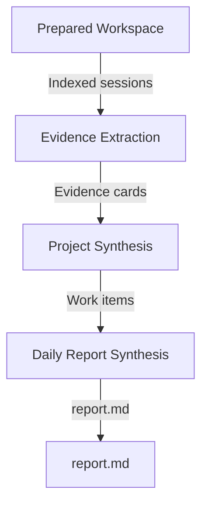

# Report Generation

Report generation is where Prompt Diary realizes the [product purposes](../product.md#purposes).
It turns a prepared workspace into `report.md`, the required artifact that must communicate the
day's work, make evidence quality visible, assess observable engagement faithfully, and surface
team learning from AI-agent usage. Those purposes converge in the final report-producing phase.

Generation starts from the [Workspace Layout](../workspace-layout.md). It should not rediscover raw
assistant sessions or reinterpret the report date. If the workspace is missing, the CLI may run
preparation first; once generation starts, the prepared workspace is the evidence boundary.

Generation is not a transcript summary, a Git summary, or an unrestricted investigation. It must
present only claims grounded in copied sessions through the project session indexes.

## Page Role

This page defines the generation orchestration contract: phase boundaries, durable artifact
handoffs, output constraints, required report shape, and links from each phase to its detailed
contract. Product-level principles live in [Prompt Diary Product](../product.md); linked
generation pages define schemas, prompt templates, grouping rules, writing rules, citation rules,
and phase-local checks.

## Orchestration Rules

- Each phase transforms one durable artifact into the next durable artifact.
- Each phase must be runnable after its prerequisites complete. It consumes only the prepared
  workspace plus durable artifacts from prior phases, and writes its own durable output before
  returning success.
- Missing, stale, or invalid prerequisite artifacts must be reported as actionable errors instead
  of causing a phase to silently re-run the whole pipeline.
- Each phase owns the correctness of its output. If an output misses required evidence, drops an
  input, overstates a claim, or violates structural rules, that is a bug in the producing phase.
- Phase-local quality checks are implementation details. The overview states what each phase must
  output, not how the phase proves it.

## Pipeline



The pipeline has three artifact-producing phases:

- [Evidence Extraction](./evidence-contract.md) turns indexed sessions into evidence cards.
- [Project Synthesis](./project-synthesis.md) turns evidence cards into work items.
- [Daily Report Synthesis](./daily-synthesis.md) turns work items into `report.md`; it is the
  convergence phase for work communication, evidence trust, engagement review, and team learning.

### Phase Output Constraints

| Phase | Input | Output | Output constraints |
| --- | --- | --- | --- |
| [Evidence Extraction](./evidence-contract.md) | Indexed sessions | Evidence cards | Cards record trigger-centered observations, terminal states, visible checks, and citations without verification judgment or unsupported outcomes. Canonical card writes use [MCP tools](./mcp-tools.md). |
| [Project Synthesis](./project-synthesis.md) | Evidence cards | Work items | Work items group material and non-material evidence without losing indexed sessions, cards, or chains; every evidence input has a disposition. |
| [Daily Report Synthesis](./daily-synthesis.md) | Work items | `report.md` | The report realizes all four product readings from the same evidence base: clear work communication, visible evidence quality, faithful engagement assessment, and reusable AI-agent usage learning. It uses the required shape, preserves no-material signals where relevant, cites claim-bearing content, and contains no forbidden high-risk content. |

### Artifact Handoffs

| Artifact | Description |
| --- | --- |
| Indexed sessions | Prepared workspace indexes plus copied sessions. They define the target spans and evidence boundary that generation must not expand. |
| Evidence cards | Per-session, trigger-centered records of user triggers, agent reactions, observed outcomes, observed checks, terminal states, and citations. |
| Work items | Project-level groupings of material and non-material evidence chains. Grouping must not lose evidence inputs: every indexed session, evidence card, and evidence chain is preserved through a disposition, even when it becomes a no-material, interrupted, failed, clarification-only, or evidence-gap item. |
| `report.md` | The final daily report in the required section order, synthesized from work items and evidence citations. Daily report synthesis uses preserved non-material evidence for evidence gaps, negative patterns, suggestions, and team-learning content. |

## Report Shape

The generated report must use this structure:

```markdown
# Prompt Diary Report - <report_date>

Status: <final|partial>
Window: <local start> to <local end> <timezone>
Overall Confidence: <high|medium|low>

## Executive Summary
## Outcome Overview
## Project Details
## Verification / Evidence Quality
## Engagement Assessment
## AI-Agent Driving Quality
## Problems / Risks / Help Needed
## Blockers and Next Actions
## No-Material / Interrupted Examples
## Follow-ups
## Evidence Gaps
```

Section intent:

- `Executive Summary`: highest-priority supported outcomes, risks, and confidence limits.
- `Outcome Overview`: cross-project scan of major outcomes with trigger, reaction, result,
  verification, confidence, and citations.
- `Project Details`: grouped project-level work items with enough context for teammates.
- `Verification / Evidence Quality`: verification status, unverified claims, contradictions,
  missing checks, and confidence limits.
- `Engagement Assessment`: observable evidence of how the user directed, reviewed, corrected, or
  resumed agent work.
- `AI-Agent Driving Quality`: reusable working mechanisms, good practices, risks, anti-patterns,
  and skills worth sharing.
- `Problems / Risks / Help Needed`: unresolved risks, unsupported claims, missing verification, or
  areas needing human input.
- `Blockers and Next Actions`: blockers or open issues paired with supported next actions.
- `No-Material / Interrupted Examples`: low-value, interrupted, paused, resumed, failed, or
  clarification-only interactions that are useful workflow signals.
- `Follow-ups`: specific future work grounded in the day's evidence.
- `Evidence Gaps`: missing or weak evidence that affects confidence.
