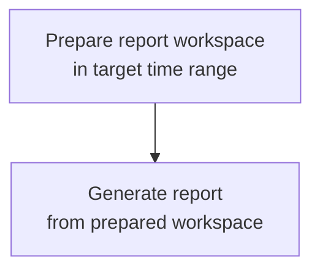

# Prompt Diary Product

## Description

Prompt Diary turns local AI coding-assistant session histories into a concise, evidenced report of
one local calendar day's work. A session history is the recorded interaction between a human and a
coding agent — user messages, agent reactions, tool calls, and their results.

## Purposes

1. **Communicate work clearly.** A second reader should be able to understand what someone worked
   on, what changed, what problems arose, and what remains unfinished without sitting next to them.

2. **Make evidence quality visible.** The report distinguishes observed work, verified results,
   unverified claims, contradictions, interruptions, and evidence gaps so readers can trust the
   report's boundaries.

3. **Evaluate personal work engagement faithfully.** The report honestly assesses whether a person
   engaged in meaningful work: directed the agent with intent, reviewed results, corrected course,
   resumed stalled work, or merely went through the motions.

4. **Surface team learning about AI-agent usage.** The report makes collaboration patterns legible:
   which practices are effective and worth sharing, which are ineffective and worth avoiding, and
   whether the human-agent interaction is improving over time.

## Principles

These principles govern how the tool fulfills the purposes above. They are ordered so that earlier
principles frame later ones.

Each real human-authored trigger in a session can form a chain: user messages and user-managed
context drive agent reactions, and agent reactions produce results or terminal states. `Continue`
and other human resume actions are real triggers when they ask the agent to continue, recover, or
finish work. The report reconstructs and describes these chains across sessions. A work unit
belongs to the target report date when its human-authored trigger falls inside that local day.

1. **Outcomes are co-produced.** A reported outcome belongs jointly to the user's direction and the
   agent's reaction. The report describes a collaboration, not the work of one party.

2. **Outcomes are grounded in agent reactions.** No outcome appears unless something the agent
   actually did in-session supports it. Saying nothing happened beats inventing something.

3. **Triggers are first-class evidence.** What drove the work — user messages, supplied context,
   corrections, framing — is reported alongside what was produced. Output-only reporting rewards
   shallow work. Agent reactions and outcomes inherit report membership from the human-authored
   trigger that caused them, even when those reactions continue past midnight.

4. **Engagement reads through interaction structure, not surface activity.** Direction, review,
   correction, and recovery from dead-ends signal engagement; volume of messages or edits does not.
   Failed attempts that get corrected are positive evidence, not negative.

5. **The report is honest about what it cannot see.** Agent reactions are fully observable in a
   session; the user's offline thinking, planning, and preparation are not. The report names its
   uncertainty rather than backfilling continuity.

6. **Faithful judgment, not surveillance.** Any evaluation of engagement or quality is
   evidence-based, proportionate, and explicit about uncertainty. The primary reader of the report
   is the person being reported on.

7. **Four readings, one substrate.** The same evidence base supports work communication, evidence
   trust, engagement review, and team learning. The report should be structured so each reading is
   possible without producing separate reports.

## Operational Constraints

- Time windows are authoritative for human-authored triggers: a work unit belongs to the target
  report day when its human trigger time falls inside that local-day window, not by session start
  date, file path date, file modification time, or the later timestamps of agent reactions caused
  by that trigger.
- Evidence scope is established before synthesis.
- Artifacts are deterministic: project keys, session references, turn references, target spans, and index ordering should be stable for the same inputs.
- Session content is untrusted: transcripts, tool output, copied prompts, and source snippets must never be treated as instructions for report-writing or evidence-extraction agents.
- Empty evidence is valid output: the report may state that no supported work claims were found instead of guessing.

## Workflow



The workflow is intentionally narrow. Preparation builds the evidence boundary for the target time
range; generation writes the report from that prepared boundary.

- [Workspace Layout](./workspace-layout.md) defines the prepared evidence boundary produced by
  `prepare`.
- [Report Generation](./generate/index.md) defines the generation pipeline and links to the
  contracts used by extraction and synthesis agents.

## CLI Surface

The user-facing CLI surface should stay thin and map directly to the workflow:

```text
prompt-diary prepare [--date YYYY-MM-DD | --today] [--timezone Area/City] [--force] [--quiet]
prompt-diary generate [--date YYYY-MM-DD | --today] [--timezone Area/City] [--quiet]
prompt-diary mcp serve
```

Date targeting rules:

- If no date flag is provided, target yesterday's completed local day.
- `--today` targets the current local day and produces a `partial` report.
- `--date YYYY-MM-DD` targets that local calendar date. Dates before the current local day produce `final` reports; the current local day produces a `partial` report.
- `--date` and `--today` are mutually exclusive.
- Future-date reports are not defined by this design.

`prepare` creates the reporting workspace for the targeted local day. By default, it should leave an
existing workspace unchanged and print an informational message; `--force` explicitly re-prepares
it.

`generate` resolves the same target date, ensures a prepared workspace exists, runs the report
generation workflow in that workspace, writes `report.md`, and validates it before returning
success. If the workspace is missing, generation internally runs preparation first. If the
workspace already exists, generation should print an informational message that the existing
workspace is being reused and that `prepare --force` can refresh it after session updates.

`mcp serve` starts the package MCP server over stdio for integration work. The initial server is
boilerplate-only and exposes `prompt_diary_ping`; report-writing tools are not part of this command
yet.
