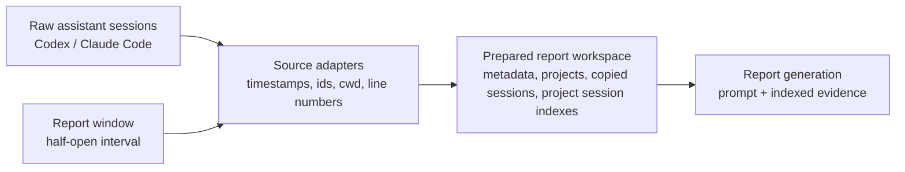
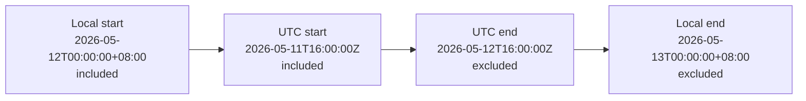

# Workspace Layout

The workspace is the prepared evidence boundary for one target report date. It packages local
assistant history into a deterministic structure that report generation can read without scanning
the user's raw session stores.



Preparation owns data discovery, date-window handling, session copying, and indexing. The workspace
keeps report inputs stable and reviewable; the detailed contracts below define how sources are
selected, grouped, copied, and indexed.

For report date `2026-05-12`, the tool creates a prepared report workspace under the reports root
like this:

```text
<reports-root>/
├── work/
│   └── 2026-05-12/
│       ├── AGENTS.md       # generated runtime instructions for Codex-backed generation
│       ├── metadata.json
│       └── projects/
│           └── ReportGenerator-e6ff7eeda632/
│               ├── project.json
│               ├── sessions.index.jsonl   # copied session inventory and target spans
│               ├── sessions/
│               │   ├── codex/
│               │   │   └── 019e1bb6-620a-7462-9fb0-d28c3acef59d.jsonl
│               │   └── claude-code/
│               │       └── 3e1dcfb6-32e7-4059-9d1c-5fddc8b8d0c3.jsonl
```

The reports root defaults to a per-user data directory (`~/.local/share/prompt-diary/` on Linux;
the platform equivalent on macOS and Windows). Override it with `--reports-root <path>`,
`PROMPT_DIARY_HOME`, or the stored config (`prompt-diary config init`); precedence is `--reports-root`
over `PROMPT_DIARY_HOME` over the stored config over the default data directory. The private audit
manifest for the same date lives beside `work/` at
`<reports-root>/private/<YYYY-MM-DD>/audit.manifest.json`.

`AGENTS.md` is generated lazily during Codex-backed generation, not during preparation. It carries
Prompt Diary's runtime language norm for generated report content and contains a generated marker;
generation replaces only marker-owned copies and refuses to overwrite an unmarked user-authored
file.

Preparation excludes root sessions whose recorded project root resolves inside the resolved reports
root. Those sessions are Prompt Diary's own generation side effects, not user-authored project work.

Copied session files keep their source filenames. The examples above use UUID-based filenames
because both Codex and Claude Code identify local session transcript files by session id rather
than by report date. Only root session transcripts are copied. Delegation prompts, tool results,
and completion notifications already recorded in a parent session remain available as evidence.

The workspace boundary is an intended-input boundary, not a security sandbox. This design does not
require filesystem or network isolation.

## Time Window Context (`metadata.json`)

The report window is an absolute half-open time interval derived from midnight at the start of the
target date to midnight at the start of the next date in the requested timezone.
`report_window_utc` is the canonical serialized representation used for deterministic trigger
inclusion checks after that local-day boundary has been resolved.

For example, `--date 2026-05-12 --timezone Asia/Shanghai` targets
`2026-05-12T00:00:00+08:00` through `2026-05-13T00:00:00+08:00`,
not `2026-05-12T00:00:00Z` through `2026-05-13T00:00:00Z`.

- Include work units whose human-authored trigger time is at or after
  `report_window_utc.start`.
- Exclude work units whose human-authored trigger time is at or after `report_window_utc.end`.
- Human triggers exactly at `report_window_utc.start` belong to this report.
- Human triggers exactly at `report_window_utc.end` belong to the next report.
- Session files may cross midnight. The target day includes a work unit by human trigger
  timestamp; indexed target spans locate that trigger and the resulting agent reactions inside
  copied sessions.

Example resolved window for `2026-05-12` in `Asia/Shanghai`:



## Metadata Context (`metadata.json`)

`metadata.json` is required at the workspace root.

```json
{
  "schema_version": 3,
  "report_date": "2026-05-12",
  "timezone": "Asia/Shanghai",
  "status": "final",
  "prepared_at": "2026-05-13T08:58:00+08:00",
  "report_window_local": {
    "start": "2026-05-12T00:00:00+08:00",
    "end": "2026-05-13T00:00:00+08:00"
  },
  "report_window_utc": {
    "start": "2026-05-11T16:00:00Z",
    "end": "2026-05-12T16:00:00Z"
  }
}
```

Rules:

- `schema_version` is `3`. Preparation reuse and generation reject older workspaces, whose indexes
  may include subagent sessions. Run `prompt-diary prepare --date YYYY-MM-DD --timezone Area/City
  --force` to rebuild them from source histories.
- `report_window_utc` is the canonical serialized trigger-inclusion boundary.
- `report_window_local` is the human-facing period shown in the report. Do not render a
  `00:00Z` to next-day `00:00Z` report window unless the requested timezone is UTC.
- `status` is `final` for a completed day and `partial` for same-day reports.
- `prepared_at` is the workspace preparation time.

## Project Context (`project.json`)

Project folders are grouped by canonical project root.

Project root derivation:

1. Prefer an explicit `cwd` or project root from the session record.
2. For Codex sessions, use `session_meta.payload.cwd`, then `turn_context.payload.cwd`, then the configured source fallback.
3. For Claude Code sessions, use top-level `cwd`, then the configured source fallback.
4. Resolve symlinks and normalize path separators when the path exists.
5. If no reliable root exists, use `unknown-project/<source>/<source_session_id>`.

Project key generation:

- Shape: `<sanitized-display-name>-<hash12>`.
- `sanitized-display-name`: basename of canonical root, with characters outside `[A-Za-z0-9._-]` replaced by `-`, repeated `-` collapsed, trimmed to 48 characters, fallback `unknown-project`.
- `hash12`: first 12 lowercase hex characters of SHA-256 over the UTF-8 canonical root string. For unknown roots, hash the fallback identity string.

Example:

```text
ReportGenerator-e6ff7eeda632
```

Each project folder contains `project.json`.

```json
{
  "schema_version": 3,
  "project_key": "ReportGenerator-e6ff7eeda632",
  "project_label": "ReportGenerator"
}
```

`project_label` is a sanitized human-readable label for report display. Session counts and source
lists are derived from the session index. Absolute project roots are not report inputs and do not
belong in `project.json`.

## Session Context (`sessions/*.jsonl`)

Adapters parse source-specific JSONL records enough to identify human-authored triggers, copy
sessions, and create the session index. Session discovery targets only root/main assistant
sessions. Source-native subagent sessions and agent-invoked child sessions are excluded from the
workspace. Claude Code child paths are skipped without opening them; other files are read only
until metadata identifies them as children. Codex subagent metadata includes every string or object
variant under `source.subagent`, `thread_source = "subagent"`, and `originator = "Claude Code"`.
Claude Code records with `isSidechain = true` also identify child sessions. Child transcript bodies
are not parsed for evidence or copied, even when the parent refers to them.

A human-authored trigger is an externally authored user message, correction, approval, resume
action, or explicit human-supplied context that asks or directs the agent to act.
[Source Session Formats](./source-session-formats.md) documents the per-source record structures
and explains how adapters distinguish human triggers from source-generated records. A human
`Continue`, `resume`, or equivalent UI action is a trigger when it asks the agent to continue,
recover, or finish work; it may also reveal that the previous agent reaction paused or stopped.
Tool results, task notifications, system records, and source-generated records with `role: user`
are not human triggers unless they carry a new externally authored instruction.

| Source | Timestamp | Session id | Project root | Missing or malformed trigger timestamp |
| --- | --- | --- | --- | --- |
| Codex | top-level `timestamp`; fallback `payload.timestamp` only for session metadata | `session_meta.payload.id`; fallback filename stem | `session_meta.payload.cwd`, then `turn_context.payload.cwd` | cannot include a trigger-owned work unit; remains available only as copied context if another trigger includes the session |
| Claude Code | top-level `timestamp` | filename stem | top-level `cwd`; fallback configured source root | cannot include a trigger-owned work unit; remains available only as copied context if another trigger includes the session |

Malformed JSONL lines are never standalone evidence for a work claim. The adapter should treat
malformed and untimestamped records as preparation diagnostics, not report evidence.

Copied root session files keep original source filenames and original record order under
`sessions/<source>/`. Adapters must preserve line numbering because the session index cites
root session line numbers.

Before writing the workspace, preparation groups selected files by `(source, source_session_id)`.
Files with the same bytes and project identity contribute one session, chosen by the
lexicographically smallest absolute source path. Conflicting content or project identities fail
preparation before workspace changes, including replacement with `--force`.

For Codex root forks, an explicit `session_meta.payload.forked_from_id` and exact complete-turn
records in a selected ancestor can prove a leading inherited prefix. Preparation compares canonical
JSON records, including timestamps and agent reactions, across all human turns before filtering by
report date. It stops at the first distinct turn, retains later turns, and omits an index row when
no target-day turns remain. Missing immediate parents, cyclic or ambiguous ancestry, and malformed
history preserve the fork's turns. A known ancestor can still prove inheritance when its own parent
is unavailable. Retained turns keep source line numbers and receive consecutive `T0001` references;
copied transcript bytes stay intact.

## Session Index Context (`sessions.index.jsonl`)

Each project has one `sessions.index.jsonl` file. It has one JSON object per copied root session
file in that project and is both the copied-session inventory and the trigger-owned span index.
Subagent sessions have no session index rows or child-file locators. Evidence about delegated work
comes from the parent session's recorded prompts, results, and completion notifications.

`session_ref` is unique within the project session index and deterministic for the same project
inputs. It gives citations a short stable handle for a copied session.

Required fields:

```json
{
  "session_ref": "S0001",
  "source": "codex",
  "source_session_id": "019e1bb6-620a-7462-9fb0-d28c3acef59d",
  "session_path": "sessions/codex/019e1bb6-620a-7462-9fb0-d28c3acef59d.jsonl",
  "target_start_line": 21,
  "target_end_line": 98,
  "turns": [
    {
      "turn_ref": "T0001",
      "turn_start_line": 21,
      "turn_end_line": 55
    },
    {
      "turn_ref": "T0002",
      "turn_start_line": 60,
      "turn_end_line": 98
    }
  ]
}
```

`session_path` is relative to the project folder and must resolve under that project's `sessions/`
directory.
Downstream evidence artifacts should reference copied sessions by `session_ref`; `session_path`
stays in the session index as the canonical copied-session locator.

`target_start_line` and `target_end_line` are the overall target span — the first turn's start line
and the last turn's end line. They are derived from `turns` for convenience; consumers that need
per-trigger boundaries should use the `turns` list.

Each `turns` item records one trigger-owned work unit inside the target span:

- `turn_ref` is a row-local prepared-turn reference such as `T0001`. It resets for each
  `sessions.index.jsonl` row and identifies a turn as `(project_key, session_ref, turn_ref)`.
- `turn_start_line` is the line of the human-authored trigger that starts this work unit. It is
  1-based and inclusive.
- `turn_end_line` is the last line of agent reactions owned by this trigger. It is 1-based and
  inclusive. For the last trigger in a session, this extends to the end of the file. For earlier
  triggers, it ends before the pre-trigger scaffolding of the next turn (see
  [Source Session Formats](./source-session-formats.md) for scaffolding rules per source).

Diagnostic data such as checksums, total line counts, event bounds, event counts, and parse warnings
is not report input.

Reference generation:

1. Within each project, sort copied root sessions by `(source, source_session_id, session_path)`.
2. Assign `session_ref` values as `S0001`, `S0002`, and so on within that project.
3. If a session lacks a source session id, use the source filename stem in the sort key and in `source_session_id`.
4. Within each session index row, assign `turn_ref` values as `T0001`, `T0002`, and so on after
   target turn construction, in the order of that row's `turns[]`.

Target span and turn construction:

- All line numbers are 1-based and inclusive.
- Each copied root session has exactly one target span for the report window. The target span is
  the union of the session's included turns.
- `target_start_line` is the first included turn's `turn_start_line`.
- `target_end_line` is the last included turn's `turn_end_line`.
- A human-authored trigger belongs to the target report date when its timestamp falls inside
  `report_window_utc`. Each in-window trigger produces one entry in `turns`. Only confirmed adjacent
  Codex message/echo pairs share a trigger; distinct adjacent human messages remain separate.
- Source-generated reset-plan bootstraps, meta messages, compaction summaries, and tool-only results
  do not create turns. Later human followups in the same root session remain eligible.
- A trigger's turn starts at the trigger line (`turn_start_line`) and ends after the agent reactions
  and outcomes caused by that trigger (`turn_end_line`), even when those reaction lines have
  timestamps outside the report window.
- A later human-authored trigger outside the report window starts a different work unit and must not
  be absorbed into this report's target span. The previous turn ends before the next trigger's
  pre-trigger scaffolding (see [Source Session Formats](./source-session-formats.md)).
- For the last trigger in the session (no successor trigger), the turn extends to the last line of
  the file.
- `turns` is ordered by `turn_start_line`. When the target span contains multiple turns, they are
  not necessarily contiguous — pre-trigger scaffolding between turns is excluded.
- If malformed, untimestamped, or non-monotonic records make a turn broader than the true
  trigger-owned work unit, preparation still records the inclusive turn it can determine
  and treats the anomaly as a preparation diagnostic.
- No separate context index is generated. The reporter can inspect surrounding lines directly in the
  copied root session file. Child session transcripts are outside the report evidence boundary.
