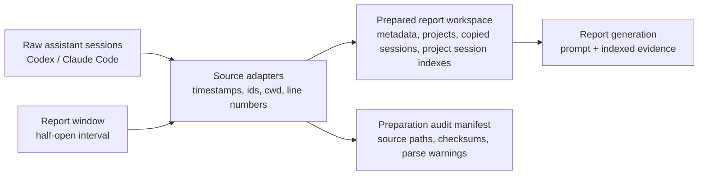
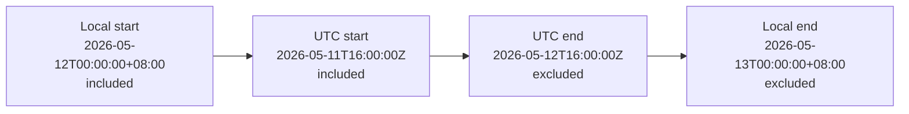

# Workspace Layout

The workspace is the prepared evidence boundary for one target report date. It contains copied
session files, normalized project metadata, and per-project session indexes that locate the
report-window portion of each copied session.



Preparation owns data discovery, timestamp parsing, date-window handling, session copying, session
indexing, and workspace layout. Discovery must not be scoped only to the report date's file path
partition. A correct first version may scan all configured JSONL files and parse events before
deciding what to copy. Optimized discovery may prefilter by parsed event bounds, adjacent date
partitions, or modification time, but the final copy decision must be based on identifiable events
inside the report window.

A source session file is copied when it has at least one identifiable event inside the report
window. It is copied whole because surrounding context and the overall coding session can matter
when writing a useful report; the session index records the target span used for report claims.

For report date `2026-05-12`, the tool creates a prepared report workspace like this:

```text
.reports/
├── work/
│   └── 2026-05-12/
│       ├── metadata.json
│       └── projects/
│           └── ReportGenerator-e6ff7eeda632/
│               ├── project.json
│               ├── sessions.index.jsonl   # copied session inventory and target spans
│               ├── sessions/
│               │   ├── codex/
│               │   │   ├── 019e1bb6-620a-7462-9fb0-d28c3acef59d.jsonl
│               │   │   └── subagents/
│               │   │       └── 019e1bb6-620a-7462-9fb0-d28c3acef59d/
│               │   │           └── 019e1bb7-0c0f-74f2-a0c4-a8f5a0ef7f7d.jsonl
│               │   └── claude-code/
│               │       ├── 3e1dcfb6-32e7-4059-9d1c-5fddc8b8d0c3.jsonl
│               │       └── subagents/
│               │           └── 3e1dcfb6-32e7-4059-9d1c-5fddc8b8d0c3/
│               │               └── agent-a9636c61b58788670.jsonl
└── private/
    └── 2026-05-12/
        └── audit.manifest.json                # preparation audit, not report input
```

Copied session files keep their source filenames. The examples above use UUID-based filenames
because both Codex and Claude Code identify local session transcript files by session id rather
than by report date. Source-native subagent transcripts are copied under
`sessions/<source>/subagents/<parent-session-id>/` when they are associated with a copied parent
session.

The workspace boundary is an intended-input boundary, not a security sandbox. This design does not
require filesystem or network isolation.

## Time Window Context (`metadata.json`)

The report window is an absolute half-open time interval derived from midnight at the start of the
target date to midnight at the start of the next date in the requested timezone.
`report_window_utc` is the canonical serialized representation used for deterministic inclusion
checks after that local-day boundary has been resolved.

For example, `--date 2026-05-12 --timezone Asia/Shanghai` targets
`2026-05-12T00:00:00+08:00` through `2026-05-13T00:00:00+08:00`,
not `2026-05-12T00:00:00Z` through `2026-05-13T00:00:00Z`.

- Include events whose event time is at or after `report_window_utc.start`.
- Exclude events whose event time is at or after `report_window_utc.end`.
- Events exactly at `report_window_utc.start` belong to this report.
- Events exactly at `report_window_utc.end` belong to the next report.
- Session files may cross midnight. The report day is determined by event timestamps; indexed
  target spans locate the relevant lines inside copied sessions.

Example resolved window for `2026-05-12` in `Asia/Shanghai`:



## Metadata Context (`metadata.json`)

`metadata.json` is required at the workspace root.

```json
{
  "schema_version": 1,
  "report_date": "2026-05-12",
  "timezone": "Asia/Shanghai",
  "status": "final",
  "prepared_at": "2026-05-13T08:58:00+08:00",
  "report_window_local": {
    "start": "2026-05-12T00:00:00+08:00",
    "end": "2026-05-13T00:00:00+08:00"
  },
  "report_window_utc": {
    "start": "2026-05-11T16:00:00Z",
    "end": "2026-05-12T16:00:00Z"
  }
}
```

Rules:

- `report_window_utc` is the canonical serialized inclusion boundary.
- `report_window_local` is the human-facing period shown in the report. Do not render a
  `00:00Z` to next-day `00:00Z` report window unless the requested timezone is UTC.
- `status` is `final` for a completed day and `partial` for same-day reports.
- `prepared_at` is the workspace preparation time.

## Project Context (`project.json`)

Project folders are grouped by canonical project root.

Project root derivation:

1. Prefer an explicit `cwd` or project root from the session record.
2. For Codex sessions, use `session_meta.payload.cwd`, then `turn_context.payload.cwd`, then the configured source fallback.
3. For Claude Code sessions, use top-level `cwd`, then the configured source fallback.
4. Resolve symlinks and normalize path separators when the path exists.
5. If no reliable root exists, use `unknown-project/<source>/<source_session_id>`.

Project key generation:

- Shape: `<sanitized-display-name>-<hash12>`.
- `sanitized-display-name`: basename of canonical root, with characters outside `[A-Za-z0-9._-]` replaced by `-`, repeated `-` collapsed, trimmed to 48 characters, fallback `unknown-project`.
- `hash12`: first 12 lowercase hex characters of SHA-256 over the UTF-8 canonical root string. For unknown roots, hash the fallback identity string.

Example:

```text
ReportGenerator-e6ff7eeda632
```

Each project folder contains `project.json`.

```json
{
  "schema_version": 1,
  "project_key": "ReportGenerator-e6ff7eeda632",
  "project_label": "ReportGenerator"
}
```

`project_label` is a sanitized human-readable label for report display. Session counts and source
lists are derived from the session index. Absolute project roots belong in the preparation audit
manifest, not in `project.json`.

## Session Context (`sessions/*.jsonl`)

Adapters parse source-specific JSONL records enough to copy sessions and create the session index.
Session discovery targets only root/main assistant sessions. Source-native subagent sessions are
skipped during initial discovery and are not copied merely because they contain target-window
timestamps. A subagent session is copied only when an indexed parent session references it through
a spawn/result association inside that parent session's target span.

| Source | Timestamp | Session id | Project root | Missing or malformed timestamp |
| --- | --- | --- | --- | --- |
| Codex | top-level `timestamp`; fallback `payload.timestamp` only for session metadata | `session_meta.payload.id`; fallback filename stem | `session_meta.payload.cwd`, then `turn_context.payload.cwd` | cannot define the target span; remains available as copied session context |
| Claude Code | top-level `timestamp` | filename stem | top-level `cwd`; fallback configured source root | cannot define the target span; remains available as copied session context |

Malformed JSONL lines are never standalone evidence for a work claim. The adapter should record
counts for malformed and untimestamped records in the preparation audit manifest.

Copied root session files keep original source filenames and original record order under
`sessions/<source>/`. Copied subagent files keep original source filenames under
`sessions/<source>/subagents/<parent-session-id>/`. Adapters must preserve line numbering because
the session index cites parent session line numbers.

## Session Index Context (`sessions.index.jsonl`)

Each project has one `sessions.index.jsonl` file. It has one JSON object per copied root session
file in that project and is both the copied-session inventory and the target-window span index.
Subagent sessions do not get their own session index rows; they are optional context for the parent
agent reaction that spawned or received them.

`session_ref` is unique within the project session index and deterministic for the same project
inputs. It gives citations a short stable handle for a copied session.

Required fields:

```json
{
  "session_ref": "S0001",
  "source": "codex",
  "source_session_id": "019e1bb6-620a-7462-9fb0-d28c3acef59d",
  "session_path": "sessions/codex/019e1bb6-620a-7462-9fb0-d28c3acef59d.jsonl",
  "target_start_line": 21,
  "target_end_line": 98,
  "subagent_path": "sessions/codex/subagents/019e1bb6-620a-7462-9fb0-d28c3acef59d",
  "target_subagents": [
    {
      "session_file": "019e1bb7-0c0f-74f2-a0c4-a8f5a0ef7f7d.jsonl",
      "source_session_id": "019e1bb7-0c0f-74f2-a0c4-a8f5a0ef7f7d",
      "agent_role": "explorer",
      "parent_spawn_line": 43,
      "parent_result_line": 81,
      "association": "spawned_or_returned_in_target_span"
    }
  ]
}
```

`session_path` is relative to the project folder and must resolve under that project's `sessions/`
directory. `subagent_path` is relative to the project folder and names the folder containing copied
subagent files for this parent session. If the parent has no associated copied subagents,
`subagent_path` is `""` and `target_subagents` is `[]`.

Each `target_subagents` item records one copied subagent transcript associated with the parent
target span:

- `session_file` is the copied source-native filename under `subagent_path`.
- `source_session_id` is the source-native subagent session id when available; otherwise use the
  filename stem.
- `agent_role` is the source-normalized role when available, such as `explorer` or `reviewer`;
  otherwise it is `null`.
- `parent_spawn_line` is the parent session line that launches the subagent and contains the
  delegation reason or prompt. It is `null` when the spawn line is unavailable.
- `parent_result_line` is the parent session line that receives the subagent output, completion
  notice, or summarized result. It is `null` when the result line is unavailable.
- `association` is `spawned_or_returned_in_target_span` when either the spawn line or result line
  falls inside the parent target span.

Other parent references to the same subagent are not indexed by default. Subagent files are copied
as richer context for parent agent reactions, not as independent report targets. Diagnostic data
such as checksums, total line counts, event bounds, event counts, and parse warnings belongs in the
preparation audit manifest.

Reference generation:

1. Within each project, sort copied root sessions by `(source, source_session_id, session_path)`.
2. Assign `session_ref` values as `S0001`, `S0002`, and so on within that project.
3. If a session lacks a source session id, use the source filename stem in the sort key and in `source_session_id`.

Target span construction:

- `target_start_line` and `target_end_line` are 1-based and inclusive.
- Each copied root session has exactly one target span for the report window.
- The target span starts at the first line with an identifiable event timestamp inside the report window and ends at the last such line.
- In a well-formed timestamp-ordered session, that span is the continuous target-window portion of the session.
- If malformed, untimestamped, or non-monotonic records make the indexed span broader than the true in-window records, preparation still records the inclusive first-to-last identifiable in-window span and records the anomaly in the preparation audit manifest.
- No separate context index is generated. The reporter can inspect surrounding lines directly in the copied root session file, and can inspect listed subagent files when richer context is useful.

## Preparation Audit Context (`audit.manifest.json`)

The preparation audit manifest records enough information to reproduce and inspect preparation
decisions.

It may include:

- Original source file paths.
- Canonical project roots.
- Source-to-workspace file mappings.
- Source and workspace checksums.
- Total line counts and parsed event bounds.
- Parse warnings, malformed line counts, untimestamped record counts, and timestamp anomalies.

The audit manifest is not an input to report generation.
